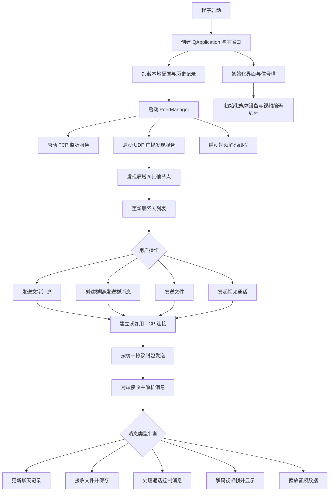
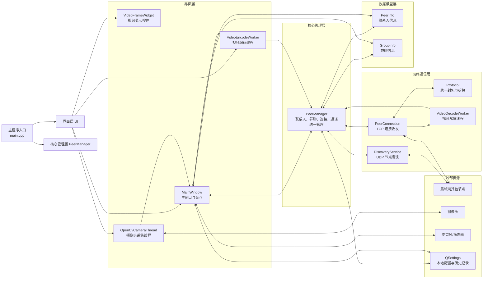
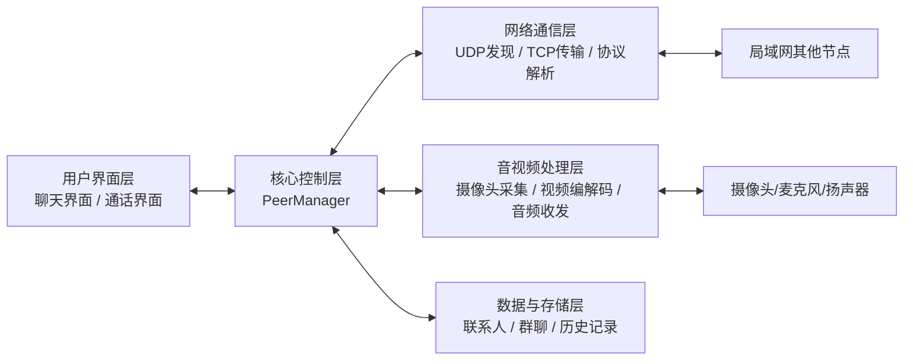
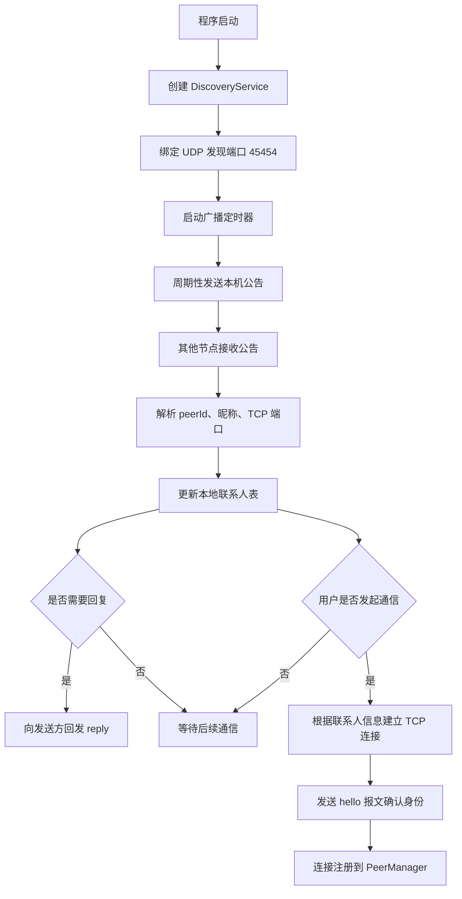
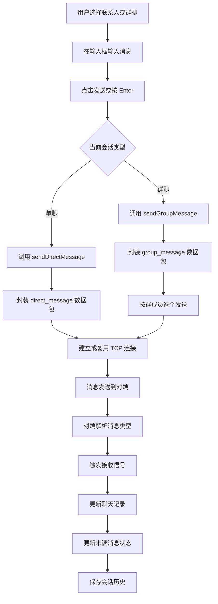
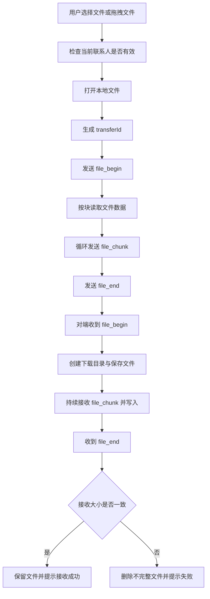
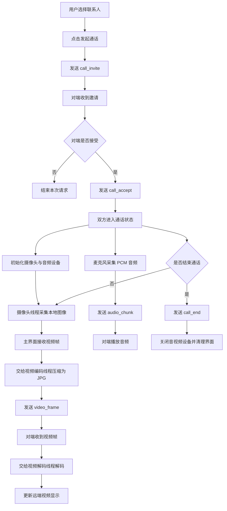
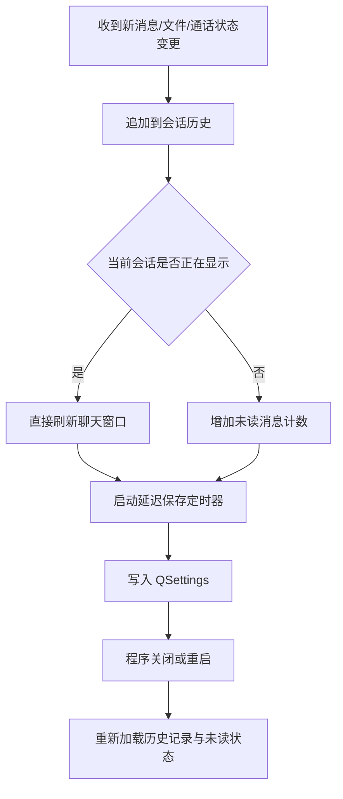

# LanLinkChat 项目流程图

下面给出基于当前 Qt 工程整理的项目总体流程图，以及几个主要功能模块的流程图。流程图采用 Mermaid 语法编写，便于后续直接复制到支持 Mermaid 的 Markdown 编辑器、Typora、在线 Mermaid 渲染器或文档平台中生成图片。

## 1. 项目总体流程图

## 1.1 项目总体模块图

这张图适合放在“系统核心功能设计”或“系统总体设计”部分，用来说明工程在结构上可以分为界面层、核心管理层、网络通信层和数据模型层。其中，`PeerManager` 是整个系统的枢纽，负责把界面交互、联系人状态、网络连接和音视频收发组织在一起。

## 1.2 答辩 PPT 简洁版总体模块图

这张图比前面的完整模块图更简洁，适合直接放进答辩 PPT。展示时可以配合一句话说明：系统以 `PeerManager` 为核心，上接界面交互，下连网络通信、音视频处理和本地数据存储，共同完成局域网聊天与视频通话功能。

## 2. 节点发现与基础连接流程图

## 3. 文字通信模块流程图

## 4. 文件传输模块流程图

## 5. 视频通话模块流程图

## 6. 会话历史与未读状态流程图

## 7. 建议放入实验报告的图示顺序

如果需要插入到实验报告中，建议采用以下顺序：

第一张放“项目总体流程图”，用于说明整个系统从启动到通信的总体流程。

第二张放“节点发现与基础连接流程图”，用于说明局域网内节点是如何建立联系的。

第三张放“文字通信模块流程图”，用于说明单聊和群聊的消息处理链路。

第四张放“视频通话模块流程图”，用于说明视频通话的完整过程。

如果篇幅允许，还可以补充“文件传输模块流程图”和“会话历史与未读状态流程图”，用于体现系统功能的完整性。
